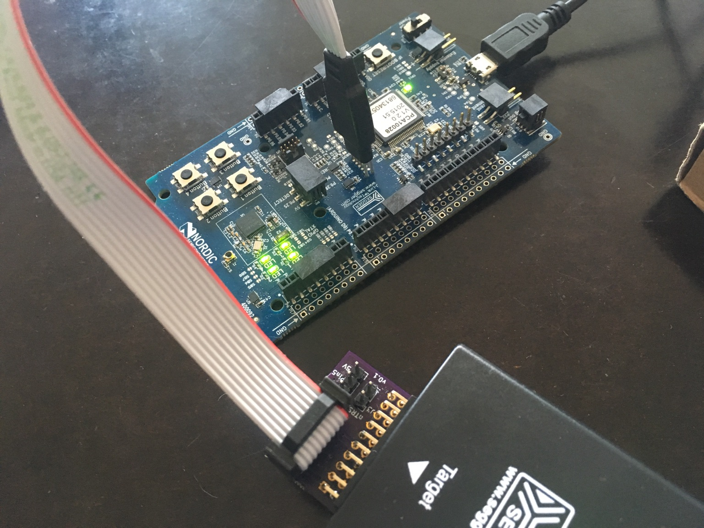

# ARM Cortex Tag-Connect 2050 Adapter

A simple adapter to connect development boards with a 10-pin Tag Connect connector to a JTAG/SWD tool like SEGGER's J-Link.

The adapter can be directly plugged into the [20-pin JTAG interface](https://www.segger.com/products/debug-probes/j-link/technology/interface-description/). On the other side, the [TC-2050-IDC](https://www.tag-connect.com/TC2050-IDC) can be plugged in.

It is can be directly [ordered at OSHpark](https://oshpark.com/shared_projects/WIUZbvZ1)

